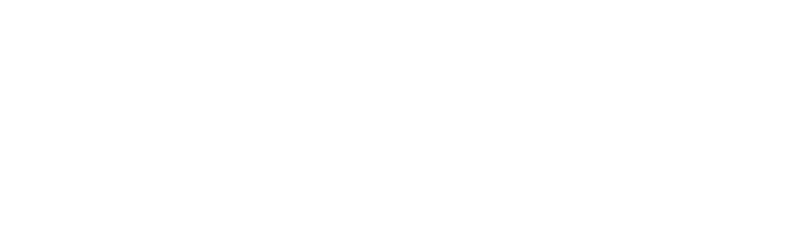

# viernulvier-4

## Mockup

To log into the admin mockup:

* **username**: admin
* **password**: 404admin

## Groepsleden

* **Matthieu De Clercq:** Groepsleider, back-end verantwoordelijke
* **Alex Nollet:** Technische lead, back-end verantwoordelijke
* **Sebastien Harris:** Systeembeheerder, back-end verantwoordelijke
* **Lander De Geeter:** Customer Relations Officer, testverantwoordelijke
* **Robin De Rudder:** Secretaris, testverantwoordelijke
* **Dominik Nowak:** front-end verantwoordelijke
* **Jill Van Ham:** front-end verantwoordelijke
* **Diana Dendauw:** front-end verantwoordelijke

## Frameworks

* **Back-end:** Typescript + NestJS
* **Front-end:** Vue + Nuxt 4
* **Database:** PostrgeSQL

## Instructies

Belangrijke commandos (allemaal uitgevoerd in de *root* map):

* `npm i`: Installeert alle benodigde dependencies om het project te kunnen uitvoeren.
* `npm run start:dev`: Start lokaal de *backend* op poort **3000** en de *frontend* op poort **3001**.
* `npm run test`: Run alle testen voor de hele stack.
* `npm run test:coverage`: Run alle testen voor de hele stack **en** genereer/print coverage statistieken.

## Documentatie

Alle relevante informatie over de technische stack, deployment en code documentatie is te vinden op
de [GitHub Pages](https://selab-2.github.io/viernulvier-4/).
