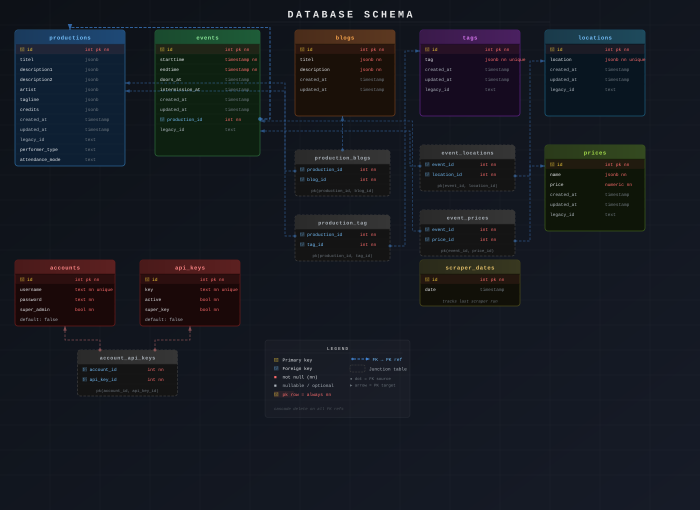

## Database

The database runs on PostgreSQL and stores all data related to productions, events, blogs, tags, locations, pricing,
accounts, and API keys. The schema is relational, uses junction tables for many-to-many relationships, and uses JSONB
fields throughout to support multilingual content.

---

## Getting Started

Install PostgreSQL by following [this guide](https://www.postgresql.org/download/), then restore the database from the
provided dump at `server/database/pg.dump`:

```bash
pg_restore -U <username> -d <database_name> server/database/pg.dump
```

This gives you a starting point that includes an admin account and an API key.

---

## Database Layout

For an interactive overview, open `server/database/db.dbml` with a DBML viewer (e.g.
the [DBML viewer plugin](https://marketplace.visualstudio.com/items?itemName=matt-meyers.vscode-dbml) for VS Code).



### Core Tables

**`productions`** – The central table. Represents a show or performance, with multilingual JSONB fields for title,
subtitle, descriptions, artist, tagline, and credits. Also holds `performer_type`, `attendance_mode`, and a
`planning_id` for external planning system references.

**`events`** – A scheduled instance of a production. Belongs to a production via `production_id` (cascade delete).
Stores `starttime`, `endtime`, `doors_at`, and `intermission_at`.

**`locations`** – Venue data stored as JSONB for multilingual support. Linked to events via `event_locations`.

**`prices`** – Ticket price tiers with a multilingual `name` (JSONB) and a numeric `price`. Linked to events via
`event_prices`.

**`tags`** – Unique multilingual JSONB tags, linked to productions via `production_tag`.

**`blogs`** – Standalone blog entries with multilingual `titel` and `description`. Linked to productions via
`production_blogs`.

---

### Junction Tables

| Table              | Joins                   | Cascade Delete |
|--------------------|-------------------------|----------------|
| `event_locations`  | `events` ↔ `locations`  | Yes            |
| `event_prices`     | `events` ↔ `prices`     | Yes            |
| `production_tag`   | `productions` ↔ `tags`  | Yes            |
| `production_blogs` | `productions` ↔ `blogs` | Yes            |
| `account_api_keys` | `accounts` ↔ `api_keys` | Yes            |

All junction tables use composite primary keys.

---

### Auth Tables

**`accounts`** – Admin user accounts with a `username`, hashed `password`, and `super_admin` flag.

**`api_keys`** – API keys for backend authentication, each with an `active` flag and a `super_key` flag for elevated
permissions. Linked to accounts via `account_api_keys`.

---

### Utility Tables

**`scraper_dates`** – Stores timestamps used by the scraper to track the last sync date.

---

### Relationships Overview

```
productions ──< events ──< event_locations >── locations
     │                └──< event_prices    >── prices
     │
     ├──< production_tag   >── tags
     └──< production_blogs >── blogs

accounts ──< account_api_keys >── api_keys
```

---

## Extra Information

As an alternative to restoring from the dump, a backup of the raw SQL setup scripts is also available. These can be used
to set up a clean empty database from scratch.

> **Important:** If you use this method, you will need to manually create an initial admin account and API key before
> the backend will function.

---

After setting up the database, make note of the following — all four are required as backend environment variables:

| Variable          | Value                           |
|-------------------|---------------------------------|
| **Username**      | Your PostgreSQL user            |
| **Database name** | The name of your database       |
| **Password**      | Your PostgreSQL user's password |
| **Port**          | Default is `5432`               |

See the [backend setup page](backend.md) for details on where to configure these.