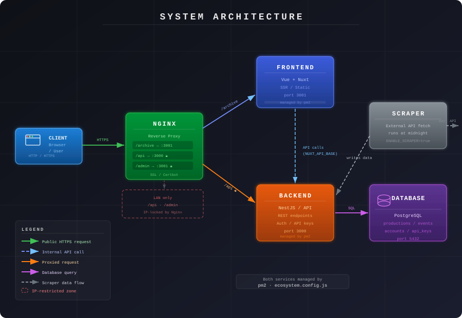

# Server Overview

This project consists of several interconnected components that must be deployed and configured together on a server to
function correctly:

- **Database** – PostgreSQL
- **Backend/API** – NestJS
- **Frontend** – Vue + Nuxt

This page provides a brief structural overview and basic setup instructions. See the linked component pages for more
detailed information.

---

## Architecture

Here is a full overview of the system architecture and how the components interact:



---

## Database

The database runs on [PostgreSQL](https://www.postgresql.org/download/). Install it on your server by
following [this guide](https://www.postgresql.org/download/), then restore the database from the provided dump:

```bash
pg_restore -U <username> -d <database_name> server/pg.dump
```

> **Note:** `<username>` and `<database_name>` refer to your PostgreSQL installation credentials.

The restored database includes an admin account and API key to get you started. Some additional configuration is still
required — please review the [database page](database.md) before proceeding.

---

## API / Backend

The backend is built with [NestJS](https://nestjs.com/). For in-depth documentation on its architecture and internals,
see the [backend overview page](insert here). For a step-by-step deployment guide, see
the [backend setup page](backend.md).

Before deploying, make sure to configure the required environment variables. An example can be found in `.env.example`
in the project root.

---

## Frontend

The frontend is built with [Vue](https://vuejs.org/) and [Nuxt](https://nuxt.com/). For implementation details, see
the [frontend pages](insert here).

Under normal circumstances, the frontend requires minimal setup and should work out of the box after following the
deployment steps below. See the [frontend page](frontend.md) if you run into issues.

---

## General Deployment

Once the database is configured and the backend environment variables are in order, you're ready to deploy.

**Prerequisites:**

- [Node.js / npm](https://nodejs.org/)
- [pm2](https://pm2.keymetrics.io/) (`npm install -g pm2`)

Run the deployment script from the project root:

```bash
bash server/server_deployment.sh
```

This will build and deploy both the backend and frontend. Default ports:

- **Backend:** `3000`
- **Frontend:** `3001`

---

## Nginx

Use the provided Nginx config to make the services publicly accessible:

```bash
sudo cp server/nginx_config /etc/nginx/sites-enabled/<your-name>
```

You can also write your own config if preferred. The provided one includes:

- **API** – LAN-only, accessible under `/api`
- **Frontend** – served over HTTP and HTTPS under `/archive`
- **Admin page** – IP-locked to LAN, accessible under `/admin`
- **Root redirect** – `/` automatically redirects to `/archive`

### HTTPS / SSL

To enable HTTPS, obtain a certificate via [Certbot](https://certbot.eff.org/):

```bash
sudo certbot --nginx -d <your-domain>
```

Certbot can update your Nginx config automatically, or you can add the certificate details manually.